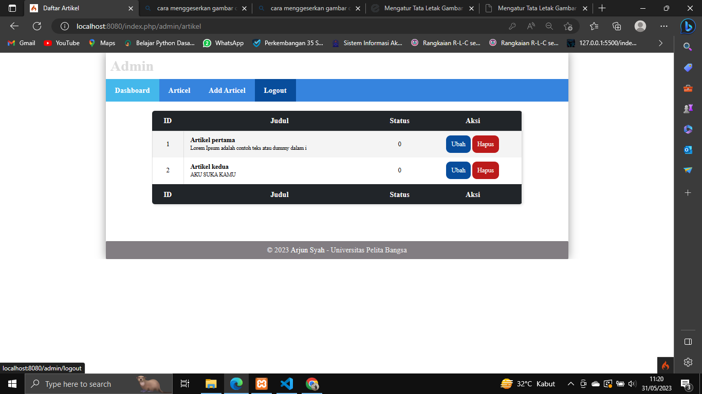

# Lab8Web-Framework Lanjutan program sebelumnya

**Nama   : Arjun Syah**  
**Nim   : 312110102**  
**Kelas : TI.21.A3**  

# Output
## Login 

## Articel

## Articel 

## Add Articel 

## Update Articel 

## Hapus Articel 

## Upload File 

## Menu Searching 

## Pagenation 

## Logout 

## Menampilkan data di aplikasi postman

## Menampilkan data spesifik di aplikasi postman

## Menambahkan data di aplikasi postman

## Menghapus data di aplikasi postman

